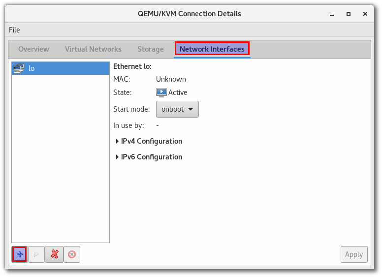
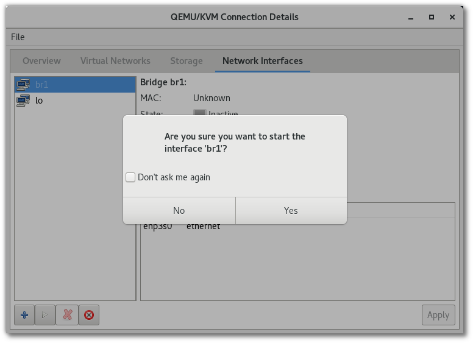

=====================
Bridge Networking KVM
=====================

setup on KVM
============
มีหลายวิธีสำหรับในการบริหารจัดการ Networking in KVM เพื่อที่จะให้ vm สามารถติดต่อออกสู่ภายนอกได้ โดย Default เป็นการเชื่อมต่อภายนอกแบบ NAT network โดยสร้าง Virtual network (virbr0) เพื่อให้ vm มาเกาะเพื่อออกไปสู่internet และ vm จะได้รับ ip จาก  virtual network

.. image:: images/vm026.png

Network Infrastructure
**********************
virsh command
-------------
libvirt command
::

	sudo su -
	virsh net-list

	 Name                 State      Autostart     Persistent
	----------------------------------------------------------
	 default              active     yes           yes

	virsh net-dumpxml default
	<network>
	  <name>default</name>
	  <uuid>88ec8022-2026-461b-bf66-7daaf33c8fc5</uuid>
	  <forward mode='nat'>
		<nat>
		  <port start='1024' end='65535'/>
		</nat>
	  </forward>
	  <bridge name='virbr0' stp='on' delay='0'/>
	  <mac address='52:54:00:c1:9f:ed'/>
	  <ip address='192.168.122.1' netmask='255.255.255.0'>
		<dhcp>
		  <range start='192.168.122.2' end='192.168.122.254'/>
		</dhcp>
	  </ip>
	</network>

brctl command
-------------
linux bridge command
::

	# brctl show
	bridge name	bridge id		STP enabled	interfaces
	virbr0		8000.000000000000	yes	

Create Bridge network
*********************
method1
-------
create bridge with virt-manager gui 
ไปที่เมนู Edit > Connection Details เลือก เมนู Network Interfaces เมนู และกดเครื่องหมาย +

เลือก interface type: ``Bridge`` และ กด ``Forward``

ในหน้าจอนี้ให้ทำการตั้งชื่อ bridge เป็น br1 และทำการเลือก physical network ``enp3s0` ที่อยู่ใน list เมื่อเลือกแล้วให้กด  ``Finish`` เพื่อดำเนินสร้าง

ให้ทำการกดปุ่มดังรูปเพื่อเริ่ม start

verify
------
::

	# ip link
	...

	6: br1: <NO-CARRIER,BROADCAST,MULTICAST,UP> mtu 1500 qdisc noqueue state DOWN mode DEFAULT group default qlen 1000
	    link/ether 5e:8c:6d:c0:9b:ed brd ff:ff:ff:ff:ff:ff

	# brctl show
	bridge name	bridge id		STP enabled	interfaces
	br1		8000.54ee758a8609	yes		enp3s0
	virbr0		8000.525400c19fed	yes		virbr0-nic

	# ip a s br1
	7: br1: <BROADCAST,MULTICAST,UP,LOWER_UP> mtu 1500 qdisc noqueue state UP group default qlen 1000
	    link/ether 54:ee:75:8a:86:09 brd ff:ff:ff:ff:ff:ff
	    inet 192.168.1.69/24 brd 192.168.1.255 scope global dynamic br1
	       valid_lft 86357sec preferred_lft 86357sec
	    inet6 fe80::56ee:75ff:fe8a:8609/64 scope link 
	       valid_lft forever preferred_lft forever

	# ip link show enp3s0 
	2: enp3s0: <BROADCAST,MULTICAST,UP,LOWER_UP> mtu 1500 qdisc fq_codel master br1 state UP mode DEFAULT group default qlen 1000
		link/ether 54:ee:75:8a:86:09 brd ff:ff:ff:ff:ff:ff

	# brctl showmacs br1
	port no	mac addr		is local?	ageing timer
	  1	54:ee:75:8a:86:09	yes		   0.00
	  1	54:ee:75:8a:86:09	yes		   0.00
	  1	bc:ee:7b:ea:67:28	no		   0.00

auto generate
-------------
virt-manager จะทำหน้าสร้าง script ให้เองอัตโนมัติ
::

	# cd /etc/sysconfig/network-scripts/

	# cat ifcfg-br1 
	DEVICE="br1"
	ONBOOT="no"
	TYPE="Bridge"
	BOOTPROTO="dhcp"
	STP="on"
	DELAY="0.0"

    # cat ifcfg-enp3s0
	DEVICE="enp3s0"
	ONBOOT="no"
	BRIDGE="br1"

    # nmcli con show
	NAME                      UUID                                  TYPE             DEVICE 
	Bridge br1                2ee981ca-5ff4-4f9b-03fe-32879aa3dc85  bridge           br1   
 

virify by ``nm-connection-editor`` 
------------------
::

nm-connection-editor

.. image:: images/bridgekvm016.png

Kernel Parameter
****************
add kernel parameter
:: 

	# vi /etc/sysctl.conf

	net.ipv4.ip_forward=1
	net.bridge.bridge-nf-call-ip6tables = 0
	net.bridge.bridge-nf-call-iptables = 0
	net.bridge.bridge-nf-call-arptables = 0

	//load parameter จะเกิด error
	# sysctl -p
	net.ipv4.ip_forward = 1
	sysctl: cannot stat /proc/sys/net/bridge/bridge-nf-call-ip6tables: No such file or directory
	sysctl: cannot stat /proc/sys/net/bridge/bridge-nf-call-iptables: No such file or directory
	sysctl: cannot stat /proc/sys/net/bridge/bridge-nf-call-arptables: No such file or directory

fix error
---------
โหลด br_netfilter kernel module โดยการใช้ command
::

	# modprobe br_netfilter

	# lsmod |grep  br_netfilter
	br_netfilter           24576  0
	bridge                126976  2 br_netfilter,ebtable_broute

	# sysctl -p

persistance load
----------------
::

    //add module ตั้งชื่อเป็น netfilter.conf (เป็นอะไรก็ได้)
	# vim /etc/modprobe.d/netfilter.conf
	br_netfilter

