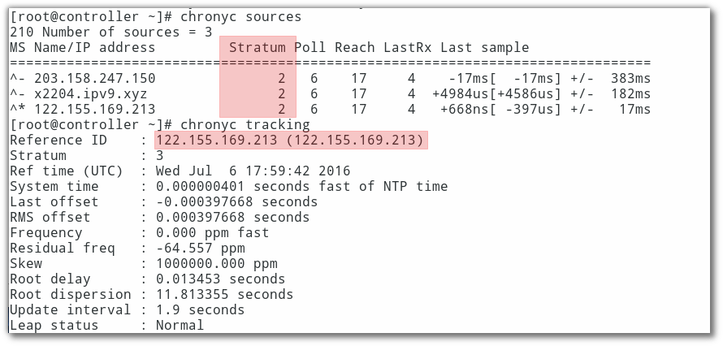
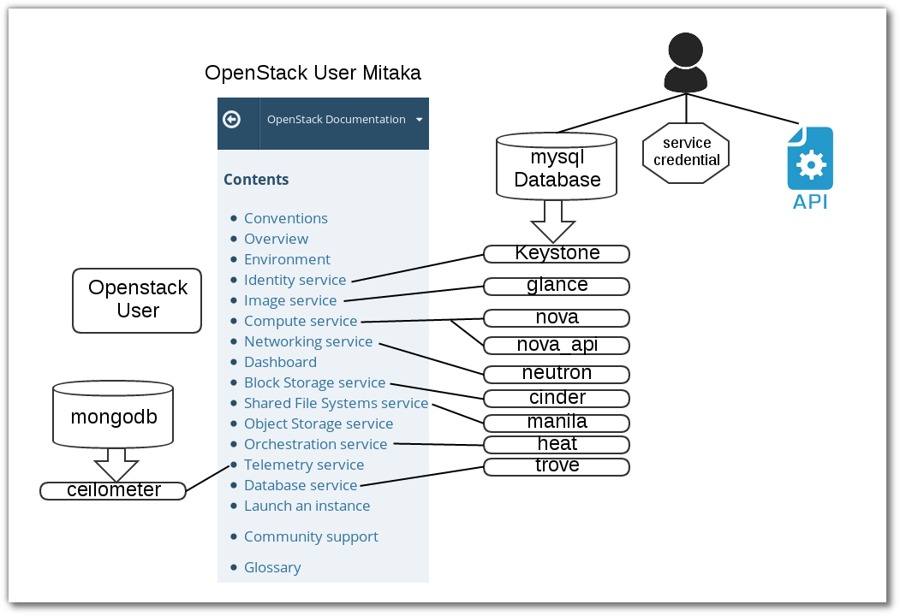

===============
Lab Environment 
===============
การสร้าง lab environment จะสร้าง โครงสร้าง ของระบบ ด้านล่าง โดยการใช้งาน Vagrant เป็นเครื่องมือสำหรับสร้าง

.. image:: images/installguidearch-neutron-networks.png

ตัวอย่าง file vagrant สำหรับการสร้าง infrastructure

.. literalinclude:: ./Vagrantfile-lab1

Automate setup
**************
Download complete file :download:`Vagrantfile-lab1 <./Vagrantfile-lab1>`

Test Lab
********
ต่อไปเป็นการทดสอบการใช้งาน Vagrantfile ให้สร้าง โครงสร้าง ด้านบน ส่วนการติดตั้งเป็นการติดตั้งแบบ manual
::

    mkdir openstack2
    vagrant plugin install vagrant-scp
    vagrant plugin install vagrant-libvirt
    sudo systemctl start firewalld

    wget https://thaiopen.github.io/SipaLinuxCourse/_downloads/Vagrantfile-lab1 
    
    mv Vagrantfile-lab1 Vagrantfile
    vagrant up

    cat << HOST  > hosts
    127.0.0.1   localhost localhost.localdomain localhost4 localhost4.localdomain4
    ::1         localhost localhost.localdomain localhost6 localhost6.localdomain6
    10.0.0.11  controller.example.com  controller
    10.0.0.21  network.example.com  network
    10.0.0.31  compute1.example.com compute1
    10.0.0.32  compute2.example.com  compute2
    10.0.0.41  block1.example.com  block1
    10.0.0.51  object1.example.com  object1
    HOST

    cat << TEST > isconnect.sh
    #!/bin/bash
    ping -c 2 controller
    ping -c 2 network 
    ping -c 2 compute1
    ping -c 2 compute2
    ping -c 2 block1
    ping -c 2 object1 
    TEST

    node="controller network compute1 compute2 block1 object1"
    echo $node
    
    //transfer file to vagrant
    for n in $node; do vagrant scp hosts $n:/home/vagrant/;done
    for n in $node; do vagrant scp isconnect.sh $n:/home/vagrant/;done 

    //test connectivity
    for n in $node; do vagrant ssh $n -c "sudo mv /home/vagrant/hosts /etc/hosts"; done
    for n in $node; do vagrant ssh $n -c "bash /home/vagrant/isconnect.sh"; done

    // set time zone
    for n in $node; do vagrant ssh $n -c "sudo timedatectl set-timezone Asia/Bangkok"; done
    for n in $node; do vagrant ssh $n -c "sudo timedatectl"; done

    //start network, stop NetworkManager
    for n in $node; do vagrant ssh $n -c "sudo systemctl start network"; done
    for n in $node; do vagrant ssh $n -c "sudo systemctl enable network"; done
    for n in $node; do vagrant ssh $n -c "sudo systemctl disable NetworkManager"; done
    for n in $node; do vagrant ssh $n -c "sudo systemctl stop NetworkManager"; done

Security
********
แต่ละ service ของ openstack จะมีสร้างฐานข้อมูลของตนเอง ดังนั้นจะมีการสร้างสร้าง password <SERVICE>_DBNAME และมี password สำหรับใช้ authentication กับ keystone <SERVICE>_PASS โดย การสร้างด้วยคำสั่ง ``openssl rand -hex 10`` เพื่อความสะดวกในการติดตั้ง ทำให้มีการสร้าง passwordlist ใช้สำหรับ database และ ใช้สำหรับ keystone

.. list-table:: **Passwords**
   :widths: 50 60
   :header-rows: 1

   * - Password name
     - Description
   * - Database password (no variable used)
     - Root password for the database
   * - ``ADMIN_PASS``
     - Password of user ``admin``
   * - ``CEILOMETER_DBPASS``
     - Database password for the Telemetry service
   * - ``CEILOMETER_PASS``
     - Password of Telemetry service user ``ceilometer``
   * - ``CINDER_DBPASS``
     - Database password for the Block Storage service
   * - ``CINDER_PASS``
     - Password of Block Storage service user ``cinder``
   * - ``DASH_DBPASS``
     - Database password for the dashboard
   * - ``DEMO_PASS``
     - Password of user ``demo``
   * - ``GLANCE_DBPASS``
     - Database password for Image service
   * - ``GLANCE_PASS``
     - Password of Image service user ``glance``
   * - ``HEAT_DBPASS``
     - Database password for the Orchestration service
   * - ``HEAT_DOMAIN_PASS``
     - Password of Orchestration domain
   * - ``HEAT_PASS``
     - Password of Orchestration service user ``heat``
   * - ``KEYSTONE_DBPASS``
     - Database password of Identity service
   * - ``NEUTRON_DBPASS``
     - Database password for the Networking service
   * - ``NEUTRON_PASS``
     - Password of Networking service user ``neutron``
   * - ``NOVA_DBPASS``
     - Database password for Compute service
   * - ``NOVA_PASS``
     - Password of Compute service user ``nova``
   * - ``RABBIT_PASS``
     - Password of user guest of RabbitMQ
   * - ``SWIFT_PASS``
     - Password of Object Storage service user ``swift``

script generate script
----------------------
ในการสร้าง password จะใช้ script ชื่อ gen_pass.sh ด้านล่าง

.. literalinclude:: ./gen_pass.sh

ทดสอบ โดย Download complete file :download:`gen_pass.sh <./gen_pass.sh>`::

    wget https://thaiopen.github.io/SipaLinuxCourse/_downloads/gen_pass.sh
    bash gen_pass.sh
    cat passwordlist

    // copy file to controller node at /root/
    vagrant scp passwordlist controller:/home/vagrant 
    vagrant ssh controller -c "sudo mv /home/vagrant/passwordlist /root"
    vagrant ssh controller
    sudo su -

    //put password to shell environment การใช้งานโดยการนำค่าตัวแปรใส่ไว้ใน shell environment
    source passwordlist

NTP Network Time Protocol
*************************
On Controller node
------------------

ติดตั้ง package ที่ controller และโหนดอื่น แต่มีรายละเอียดของ ``/etc/chrony.conf`` โดยให้เครื่อง controller node 
ชี้ตรงไปยัง ntp server ส่วนเครื่องอื่นให้ชี้มาที่เครื่อง controller ติดตั้ง package ชื่อว่า chrony เพื่อต้องการ  sync เวลาให้กับทุกๆโหนด 
โดยสามารถที่จะเข้าไปยัง เครื่อง controller ได้จากเครื่อง host โดยการใช้คำสั่ง ``vagrant ssh controller`` 
โดยผ่านทาง secure shell ได้โดยตรง
::
   
    for n in $node; do vagrant ssh $n -c "sudo yum install chrony -y"; done
    vagrant ssh controller
    sudo su -
    vi /etc/chrony.conf 

เพิ่ม รายชื่อ ของ ntp server
::

    #line3-6
    server 0.centos.pool.ntp.org iburst
    server 1.centos.pool.ntp.org iburst
    server 2.centos.pool.ntp.org iburst
    server 3.centos.pool.ntp.org iburst

     #เปลี่ยนเป็็น

    server 1.th.pool.ntp.org iburst
    server 0.asia.pool.ntp.org iburst
    server 2.asia.pool.ntp.org iburst

     #อนุญาติให้ client เข้ามา sync
    #line21
    allow 10.0.0.0/24

     #ให้ restart service chrony.conf 
    
    systemctl start chronyd.service
    systemctl enable chronyd.service
    chronyc sources
    chronyc tracking

    exit
    exit
     #กลับออกไป ที่ host

On other node
--------------
::

    node="network compute1 compute2 block1 object1"
    echo $node
    for n in $node; do vagrant ssh $n -c "sudo systemctl start chronyd; sudo systemctl enable chronyd"; done
    for n in $node; do vagrant ssh $n -c "sudo sed -i.bak '3,6d' /etc/chrony.conf"; done
    for n in $node; do vagrant ssh $n -c "sudo sed -i.bak '3i server 10.0.0.11 iburst' /etc/chrony.conf"; done
    for n in $node; do vagrant ssh $n -c "sudo systemctl restart chronyd"; done
    for n in $node; do vagrant ssh $n -c "sudo chronyc tracking"; done

OpenStack packages
******************
แต่ละ distribution ก็มี packages สำหรรับการติดตั้ง openstack การติดตั้งควรติดตั้ง package จาก repo ที่ล่าสุด และต้อง update ให้เรียบร้อย
* Centos 7 มี extra repo เพื่อติดต้ง openstack สามารถติดตั้ง โดย  ``yum install centos-release-openstack-mitaka``

::

    node="controller network compute1 compute2 block1 object1"
    for n in $node; do vagrant ssh $n -c "sudo yum install -y centos-release-openstack-mitaka"; done
    for n in $node; do vagrant ssh $n -c "sudo yum upgrade -y"; done

    for n in $node; do vagrant ssh $n -c "sudo yum install -y python-openstackclient "; done

    //automatically manage security policies for OpenStack services
    for n in $node; do vagrant ssh $n -c "sudo yum install -y openstack-selinux"; done

Mysql on Controller
*******************
เกือบทุก openstack service มีการใช้งาน sql database เพิ่อเก็บข้อมูล โดยทั่วไป database จะถูกติดตั้ง บน controller node 
การติดตั้ง database จะขึ้นกับแต่ละ distro สามารถเลือกติดตั้งได้ทั้ง  Mariadb(Mysql) หรือ PostgresSQL

install mariadb on controller
-----------------------------
#. install package
::
    
    vagrant ssh controller
    sudo su -
    yum install -y mariadb mariadb-server python2-PyMySQL
    yum install -y openstack-utils
    yum install -y wget

#. create and edit /etc/my.cnf.d/openstack.cnf
::

    mv /etc/my.cnf.d/mariadb-server.cnf /etc/my.cnf.d/openstack.cnf

    [mysqld]
    ...

    bind-address = 10.0.0.11
    default-storage-engine = innodb
    innodb_file_per_table
    max_connections = 4096
    collation-server = utf8_general_ci
    character-set-server = utf8

#. Finalize install
::
    
    systemctl enable mariadb.service
    systemctl start mariadb.service
 
    //don't forget อย่าลืม
    source passwordlist

    //test ทดสอบค่า
    echo $DB_PASS
    b2d1a3116eb60718f3c4

    //set root password ตั้งค่า password

    mysql_secure_installation

    --or--

    mysql -u root <<-EOF
    UPDATE mysql.user SET Password=PASSWORD('$DB_PASS') WHERE User='root';
    DELETE FROM mysql.user WHERE User='root' AND Host NOT IN ('localhost', '127.0.0.1', '::1');
    DELETE FROM mysql.user WHERE User='';
    DELETE FROM mysql.db WHERE Db='test' OR Db='test\_%';
    FLUSH PRIVILEGES;
    EOF

No SQL Server
*************
::
   
    yum install -y mongodb-server mongodb

    vi /etc/mongod.conf 

    6 bind_ip = 10.0.0.11
    113 smallfiles = true

    systemctl enable mongod.service
    systemctl start mongod.service

Message queue
*************
ในการdeploy ต้องดูขนาดของ journalfile ด้วย
::

    yum install rabbitmq-server
    systemctl enable rabbitmq-server.service
    systemctl start rabbitmq-server.service

    //source passwordlist to shell

    echo $RABBIT_PASS
    rabbitmqctl add_user openstack $RABBIT_PASS

    rabbitmqctl set_permissions openstack ".*" ".*" ".*"
    (result)
    Setting permissions for user "openstack" in vhost "/" ...

Memcached
*********
ในการ  deploy จริงต้องทำ security เพิ่ม
::

    yum install memcached python-memcached
    systemctl enable memcached.service
    systemctl start memcached.service

Create User in Data
*******************
user ที่จะต้องสร้าง ใน openstack 

Download complete file :download:`gen_database.sh <./gen_database.sh>`::

    //how to use file gen_database.sh
    wget https://thaiopen.github.io/SipaLinuxCourse/_downloads/gen_database.sh
    
    //check file passwordlist
    ls -l passwordlist

undo ลบ database และ ลบ user ที่สร้างขึ้นจากคำสั่งด้านบน 
::

    source passwordlist
    //show database
    mysql -uroot -p$DB_PASS -e "show databases;"
    dbs="keystone glance nova_api nova neutron cinder manila heat aodh trove"
    for d in $dbs; do  mysql -uroot -p$DB_PASS -e "DROP DATABASE $d" ; done
    mysql -uroot -p$DB_PASS -e "show databases;"
    +--------------------+
    | Database           |
    +--------------------+
    | information_schema |
    | mysql              |
    | performance_schema |
    +--------------------+

    //show user
    mysql -uroot -p$DB_PASS -e "SELECT User,host from mysql.user;"

    services="keystone glance nova neutron cinder manila heat aodh trove"
    for s in $services; do  mysql -uroot -p$DB_PASS -e "DROP USER  '$s'@'%'" ; done
    for s in $services; do  mysql -uroot -p$DB_PASS -e "DROP USER  '$s'@'localhost'" ; done
    for s in $services; do  mysql -uroot -p$DB_PASS -e "DROP USER  '$s'@'controller.example.com'" ; done

Reset Password Mariadb
**********************
ในบางครั้งอาจมีความจำเป็น ที่จะต้องเปลี่ยน root password  สามารถทำได้ดังนี้ 

Step1
-----
หยุดการทำงานของ mariadb
::

    sudo ps -ef | grep mysql
    sudo systemctl stop mariadb

Step2
สั่งคำสั่ง start mysql โดยไม่ผ่าน grant-tables เพื่อให้สามารถใช้งาน database โดย root แบบไม่ต้องใช้ password
::

    mysqld_safe --skip-grant-tables &

    [1] 3430
    [root@controller ~]# 160712 13:12:02 mysqld_safe Logging to '/var/log/mariadb/mariadb.log'.
    160712 13:12:02 mysqld_safe Starting mysqld daemon with databases from /var/lib/mysql

Step3

::

    mysql -u root

Step4
เปลี่ยน password
::

    MariaDB [(none)]> use mysql;
    MariaDB [mysql]> UPDATE user SET password=PASSWORD("new_password") WHERE User='root';
    MariaDB [mysql]> FLUSH PRIVILEGES;
    MariaDB [mysql]> quit;

Step5
หยุดการทำงาน โดยการตรวจสอบ process id (pid)
::

    ps -ef | grep mysql
    root      3430  3360  0 13:12 pts/0    00:00:00 /bin/sh /bin/mysqld_safe --skip-grant-tables
    mysql     3538  3430  0 13:12 pts/0    00:00:00 /usr/libexec/mysqld --basedir=/usr
    
    //kill ทั้ง สอง process เครืองของท่านอาจมีหมายเลขไม่ตรง
    kill -9 3430
    [1]+  Killed                  mysqld_safe --skip-grant-tables

    kill -9 3538   

    //verify
    ps -ef | grep mysql
    root      3678  3360  0 13:16 pts/0    00:00:00 grep --color=auto mysql 
 
Step6 
เริ่มต้นการทำงานใหม่ พร้อมกับ passwordใหม่
::

    systemctl start mariadb
    mysql -u root -p
