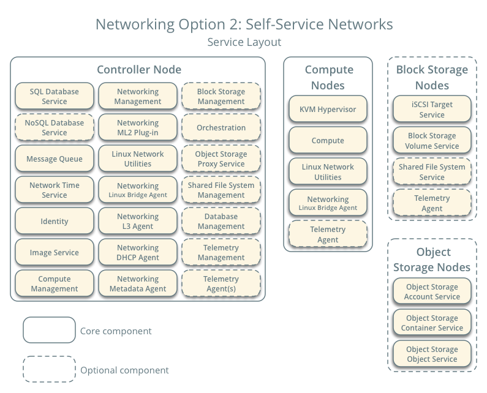

===============================
Openstack intro Mitaka Document
===============================
Openstack project เป็น opensource cloud computing platform เพื่อสร้าง cloud environment เพื่อต้องการสร้างและขยายระบบ  Openstack จะทำหน้าที่ในส่วนของ Infrastructure-as-a-Service (IaaS) โดยประกอบด้วย Services ต่างๆ ที่ทำงานอยู่บน Node ต่างๆ การทำงาน service ต่างๆ จะเป็นลักษณะที่เรียกว่า Application Programming Interface (API) พัฒนาด้วยภาษา python เพื่อเป็นการศึกษาและพัฒนาการใช้งาน openstack จะเป็นเรียนรู้ step-by-step ในการติดตั้ง  service ตามลำดับเพื่อให้เห็นการทำงานเป็นขั้นตอน

.. list-table:: **OpenStack services**
   :widths: 20 15 70
   :header-rows: 1

   * - Service
     - Project name
     - Description
   * - `Dashboard <http://www.openstack.org/software/releases/liberty/components/horizon>`_
     - `Horizon <http://docs.openstack.org/developer/horizon/>`_
     - Provides a web-based self-service portal
       to interact with underlying OpenStack services,
       such as launching an instance, assigning IP
       addresses and configuring access controls.
   * - `Compute <http://www.openstack.org/software/releases/liberty/components/nova>`_
     - `Nova <http://docs.openstack.org/developer/nova/>`_
     - Manages the lifecycle of compute instances in an
       OpenStack environment. Responsibilities include
       spawning, scheduling and decommissioning of virtual
       machines on demand.
   * - `Networking <http://www.openstack.org/software/releases/liberty/components/neutron>`_
     - `Neutron <http://docs.openstack.org/developer/neutron/>`_
     - Enables Network-Connectivity-as-a-Service for
       other OpenStack services, such as OpenStack Compute.
       Provides an API for users to define networks and the
       attachments into them. Has a pluggable architecture
       that supports many popular networking vendors and
       technologies.
   * - **Storage**
     -
     -
   * - `Object Storage <http://www.openstack.org/software/releases/liberty/components/swift>`_
     - `Swift <http://docs.openstack.org/developer/swift/>`_
     - Stores and retrieves arbitrary unstructured
       data objects via a :term:`RESTful`, HTTP based API.
       It is highly fault tolerant with its data replication and
       scale-out architecture. Its implementation is not like a
       file server with mountable directories. In this case,
       it writes objects and files to multiple drives, ensuring the
       data is replicated across a server cluster.
   * - `Block Storage <http://www.openstack.org/software/releases/liberty/components/cinder>`_
     - `Cinder <http://docs.openstack.org/developer/cinder/>`_
     - Provides persistent block storage to running instances. Its pluggable
       driver architecture facilitates the creation and management of
       block storage devices.
   * - **Shared services**
     -
     -
   * - `Identity service <http://www.openstack.org/software/releases/liberty/components/keystone>`_
     - `Keystone <http://docs.openstack.org/developer/keystone/>`_
     - Provides an authentication and authorization service
       for other OpenStack services. Provides a catalog of endpoints
       for all OpenStack services.
   * - `Image service <http://www.openstack.org/software/releases/liberty/components/glance>`_
     - `Glance <http://docs.openstack.org/developer/glance/>`_
     - Stores and retrieves virtual machine disk images.
       OpenStack Compute makes use of this during instance
       provisioning.
   * - `Telemetry <http://www.openstack.org/software/releases/liberty/components/ceilometer>`_
     - `Ceilometer <http://docs.openstack.org/developer/ceilometer/>`_
     - Monitors and meters the OpenStack cloud for billing, benchmarking,
       scalability, and statistical purposes.
   * - **Higher-level services**
     -
     -
   * - `Orchestration <http://www.openstack.org/software/releases/liberty/components/heat>`_
     - `Heat <http://docs.openstack.org/developer/heat/>`_
     - Orchestrates multiple composite cloud applications by using
       either the native :term:`HOT <Heat Orchestration Template (HOT)>` template
       format or the AWS CloudFormation template format, through both an
       OpenStack-native REST API and a CloudFormation-compatible
       Query API.

|

Architecture
============
ตัวอย่างของ architecture ที่ใช้้งาน อย่างน้อย 2 โหนด สร้างโดย virtual machine ดังตัวอย่างนี้ เป็นตัวอย่างการช้งานในรูปแบบ production ขนาดเล็ก:

* Networking Agent จะติดตั้งใน controller node หรือ ติดตั้งใน network node ที่แยกออกมา
* Overlay (tunnel) Traffic สามารถให้ติดต่อสื่อสารผ่านทาง management network หรือ แยก ออกมาเป็น data network ก็ได้
* Object storage node1,2 ติดตั้ง swift
* Block storage ติดตั้ง iscsi 

.. image:: images/hwreqs.png

Node hardware requiements
*************************

controller
----------

controller node ทำหน้าที่ run services ได้แก่  identity service, image service, ส่วน management ของ compute, 
ส่วน management ของ Networking, network agent, dashboard , sql database, message queue, และ ntp 
นอกจากนั้นยัสามารถ run ส่วน manage ของ Block storage, object storage, orchestration และ Telemetry service

.. note:: controller ต้องการ interface อย่างน้อย ต้องมี 2  interface

compute
-------

compute node เป็นส่วนที่ทำหน้าสร้าง vm (instance) มี hypervisor ทำงานอยู่ โดย default จะใช้ kvm และจะต้องมีส่วน ที่ run Networking service agent  
ที่จะทำหน้าที่เชื่อม vm เข้ากับ virtual network และยัง run firewall services ให้แก่ vm เรียกว่า security groups

.. note:: compute ต้องการ interface อย่างน้อย ต้องมี 2  interface ในระบบ cloud อาจมี compute node ได้หลาย Node

Block storage
-------------

block storage คือ node ที่มี disk storage มีการให้บริการ ในรูปแบบของ Block storage ติดตั้งอยู่ และมีการ  iscsi ทำหน้าที่ share file system 
ผ่านทาง network การสือสาร สามารถสือสารผ่านทาง management network ได้ถ้า traffic ไม่สูงมากนัก แต่แนะนำควรแยก ออกมา ผ่านทาง storage network 
เพื่อเพิ่มประสิทธิภาพ และความปลอดภัย

.. note:: compute ต้องการอย่างน้อย interface 1   interface

Block storage
-------------

ทางเลือกของ storage ในระบบ cloud นอกจากจะเป็น Block device ยังสามารถใช้ object storage ร่วมได้ ในที่นี้จะทำงานติดตั้ง swift storage เป็นพื้นฐาน

.. note:: compute ต้องการอย่างน้อย interface 1   interface

Networking 
**********

option1 Provider network
------------------------
provider networks  คือ การ ติดตั้งใช้งาน openstack networking service โดย เป็นการทำงาน ใน Layer 2 (bridge/switch) 
โดย  vm จะ bridge โดยตรงกับ physical network ภายนอก และจะต้องการอาศัย network ภายนอก ทำหน้าที่  เป็น layer 3 (routing) ให้

.. note:: ในoption จะไม่สามารถสร้าง  private network ของตนแอง  ไม่สามารถมี router  และจะไม่สามารถใช้งาน 
LBaaS และ  FWaaS

layout services สำหรับ option 1 ที่จะต้องติดตั้ง:

.. image:: images/network1-services.png

option2 Provider network
------------------------
เป็นรูปแบบที่ openstack จะจัดการ network ของตัวเอง (self-service) โดยจะรับผิดชอบทั้ง layer-3 service ที่ทำหน้า routing traffic จาก vm 
ไปยัง physical network โดยใช้ NAT และ รองรับการใช้งาน overlay network เช่น VXLAN, GRE นอกจากนั้นยังรองรับการให้บริการของ LBaaS, FWaaS

layout services สำหรับ option 2 ที่จะต้องติดตั้ง:

