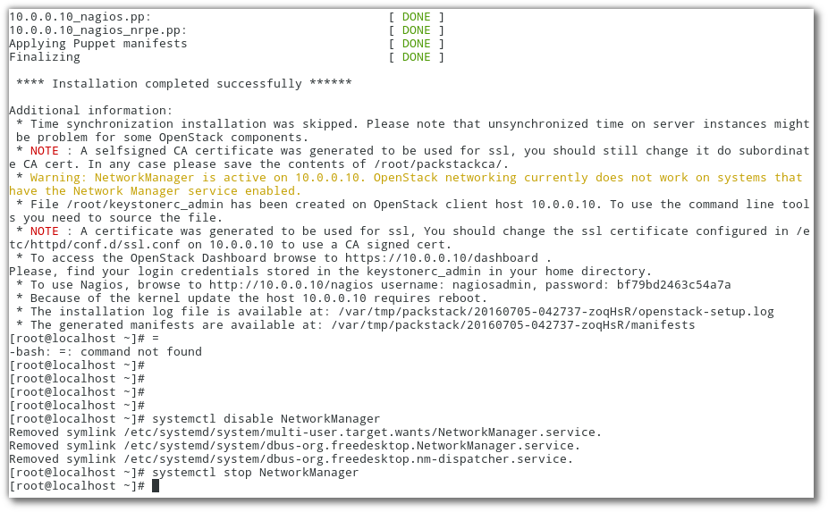

========================
Openstack with Packstack
========================

packstack
=========

vagrant
-------
สร้าง directory ชื่อ openstack และภายในมี Vagrantfile ดังนี้
::

	# -*- mode: ruby -*-
	# vi: set ft=ruby :

	$script = <<SCRIPT
	echo "run provisioning..."
	echo 'root:password' | sudo chpasswd
	sudo sed -i s/SELINUX=enforcing/SELINUX=disabled/g /etc/selinux/config
	yum install -y epel-release
	yum install -y centos-release-openstack-mitaka
	yum update -y
	yum install -y openstack-packstack
	SCRIPT

	Vagrant.configure("2") do |config|
	  config.vm.box = "centos/7"
	  config.vm.define :controller do |node|
		    node.vm.network :private_network, :ip => "10.0.0.10"
		    node.vm.network :private_network, :ip => "20.0.0.10"
		    node.vm.provider :libvirt do |domain|
		      domain.uri = 'qemu+unix:///system'
		      domain.driver = 'kvm'
		      domain.host = "server1.example.com"
		      domain.memory = 8192
		      domain.cpus = 4
		      domain.nested = true
		      domain.volume_cache = 'none'
		      domain.storage :file, :size => '20G'
		    end
            node.vm.provision "shell", inline: $script 
	  end
	  config.vm.define :compute do |node|
		    node.vm.network :private_network, :ip => "10.0.0.11"
		    node.vm.network :private_network, :ip => "20.0.0.11"
		    node.vm.provider :libvirt do |domain|
		      domain.uri = 'qemu+unix:///system'
		      domain.driver = 'kvm'
		      domain.host = "server2.example.com"
		      domain.memory = 4096
		      domain.cpus = 2
		      domain.nested = true
		      domain.volume_cache = 'none'
		    end
            node.vm.provision "shell", inline: $script 
	  end
	end

เข้าไปยัง controller
::

	vagrant ssh controller
    sudo su -
    //set selinux to disable
    getenforce
    sed -i s/SELINUX=enforcing/SELINUX=disabled/g /etc/selinux/config
    --or--
    vi /etc/selinux/config

    setenforce 0

Disk prepare for cinder
-----------------------
::

    fdisk -l
    pvcreate /dev/vdb
    vgcreate cinder-volumes /dev/vdb
    packstack --gen-answer-file  answerfile001.txt
  
    sed -i.orig s/192.168.121.158/10.0.0.10/g  answerfile001.txt
    sed -i s/CONFIG_HEAT_INSTALL=n/CONFIG_HEAT_INSTALL=y/g answerfile001.txt
    
	--ตัวอย่าง--
    grep -n ADMIN_PW  answerfile001.txt
    vim  answerfile001.txt +(line no)
    
    CONFIG_KEYSTONE_ADMIN_PW=passwd
    CONFIG_LBAAS_INSTALL=y
    CONFIG_NEUTRON_METERING_AGENT_INSTALL=y
    CONFIG_NEUTRON_FWAAS=y
    
    CONFIG_NEUTRON_ML2_TYPE_DRIVERS=vlan
    CONFIG_NEUTRON_ML2_TENANT_NETWORK_TYPES=vlan
    CONFIG_NEUTRON_ML2_VLAN_RANGES=physnet1:1:1000
   
    CONFIG_NEUTRON_OVS_BRIDGE_MAPPINGS=physnet1:br-eth2
    CONFIG_NEUTRON_OVS_BRIDGE_IFACES=br-eth2:eth2

    CONFIG_HEAT_CFN_INSTALL=y
    CONFIG_HORIZON_SSL=y
    CONFIG_PROVISION_DEMO=n

Run
---
::

    packstack --answer-file answerfile001.txt

.. image:: images/openstack-two-machine-two-nic.png
    

ผลการ Run

