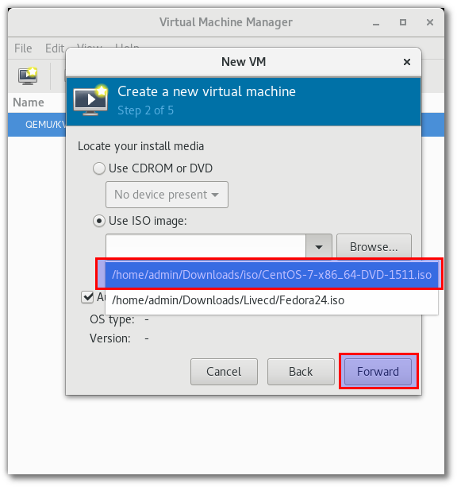
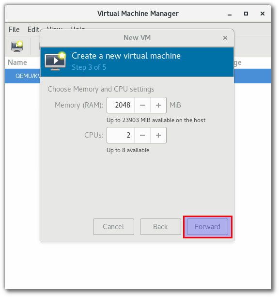
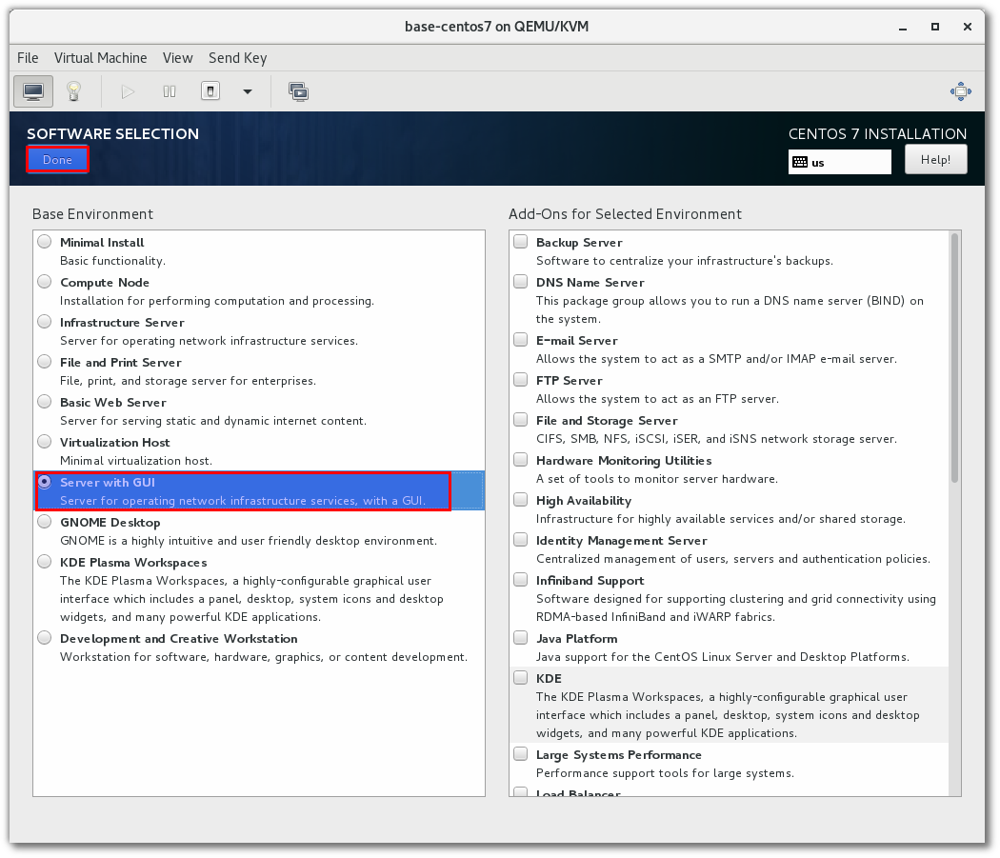
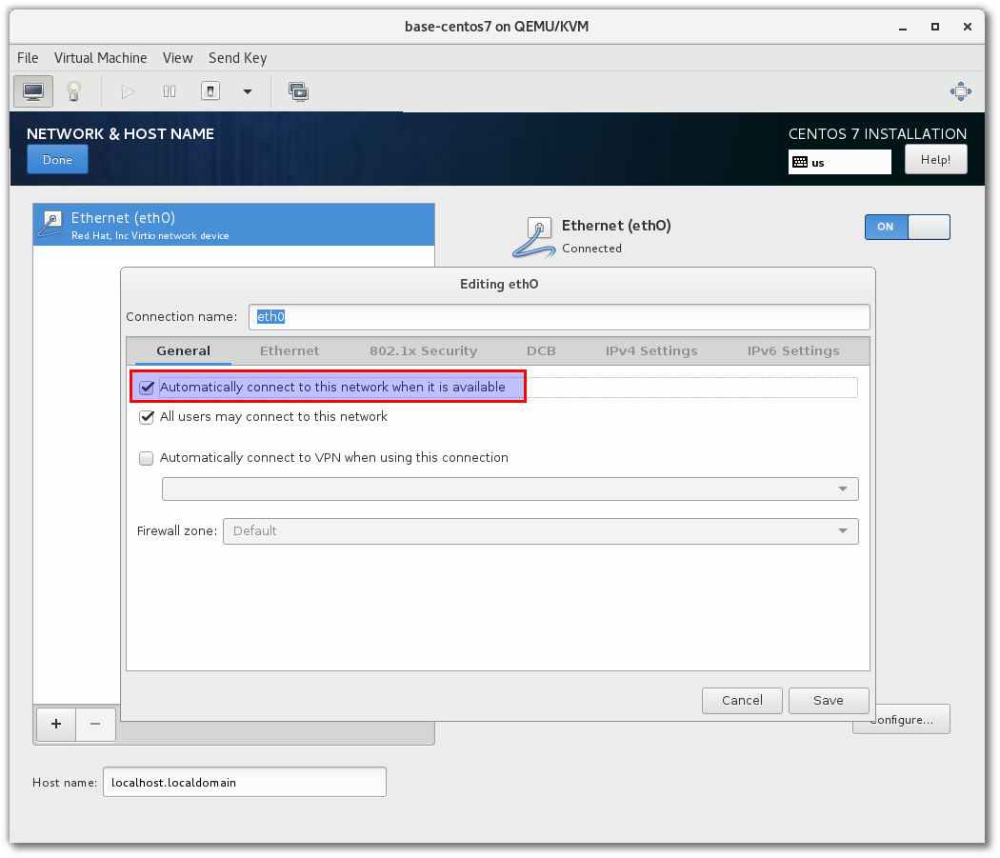
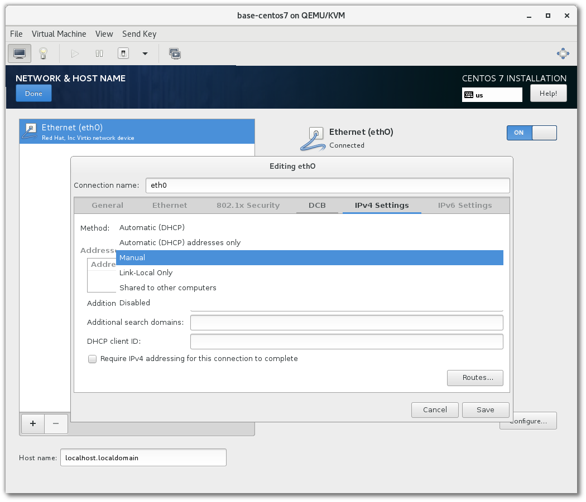

===================
SetupVM for Testing
===================

Clone VM
========
สิ่งต้องเตรียมให้พร้อม

* เครื่อง host จะต้องติดตั้ง package kvm,libvirt,virt-manager ให้พร้อม `Install Virtualization System`_
* ให้ Download iso image ให้พร้อม 

Geting clone vm with virt-tools
*******************************

สร้าง Centos 7 vm ด้วย virt manager มีขึ้นตอนดังนี้

#.  เปิด virt-manager เลือกเมนู File > New Virtual Machine
#. จะแสดง กล่องข้อความ ขึ้นมาดังรูป ให้เลือก ตัวเลือก แรก ``Local install media (ISO image or CDROM)`` เนื่องจากจะทำการติดตั้งจากไฟล์ชนิด iso ที่ต้องเตรียมไว้ 

.. image::  images/vm001.png

3. ต่อมาให้เลือก ปุ่มที่เขียนไว้ว่า ``Forward`` โดยจะอยู่ในแถวด้านล่าง
#. หลังจากนั้นให้เลือกตัวเลือก ``Use ISO image``และเลือกfile iso ที่ได้ Download ไว้ก่อนล่วงหน้า

4. เลือก ขนาดของ CPU ที่ต้องการ  โดยจะหน่วยเป็น MiB ดังนั้นตัวอย่างถ้าเราต้องการ vm ที่มี ขนาดหน่วยความจำ 2G ให้กำหนดเป็น 2048 และเลือกขนาด CPU เป็น 2 เมื่อเลือกเสร็จแล้วก็กด ``Forward``เพืิ่มดำเนินการต่อ

5. เลือกขนาดของ disk ที่ต้องการ ในที่นี้เลือกขนาด 40 มีหน่วยเป็น GiB ในบางกรณีที่ไม่ต้องการใช้เนื้อที่มากก็สามารถเลือกขนาดการทดสอบได้เป็น 20 GiB หลังจากเลือกขนาดที่ต้องการแล้ว ก็กด ``Forward``เพืิ่มดำเนินการต่อ

6. ตั้งชื้อของ Vm ที่ต้องการเช่น base-centos7 โดยตั้งชี้อเป็นอะไรก็ได้ตามที่ต้องการ แนะนำให้ตั้งชื่อ ``base-*`` เพื่อให้สังเกตุเท่านั้น

.. image::  images/vm005.png

7. เข้าสู่ขั้นตอนการตั้ดตั้ง โดยจะต้องเลือก เมนู ``Install CentOS `` สามารถสัั่งเกตุว่าจะต้องมีอักษรสีขาวแสดงว่าได้ทำการเลือกแล้ว โดยสามารถใช้ cursor up/down เพื่อที่การเลื่อน

.. image::  images/vm006.png

8. เลือกภาษาในระหว่างการติดตั้ง โดยจะเลือก ``English``  สามารถเลือกเมนูเสริมให้สะดวกในการติดตั้ง   View > Resize to VM เพื่อให้มีขนาดยืดหยุ่นตาม

.. image::  images/vm007.png

9. เข้าสู่การหน้าหลักสำหรับการติดตั้ง 

.. image::  images/vm008.png

10. เริ่มโดยการกำหนด timezone โดยใช้ mouse คลิกไปที่แผนที่บริเวณประเทศไทย และแสดงผลในกล่องข้อความด้านบน Asia | Bangkok หลังจากนัั้นให้กด ``Done`` เพื่อกลับไปยัง เมนู หลัก

11. กดเมนู SOFTWARE SELECTION เลือกติดตั้ง แบบ ``Server with GUI`` กด Done

12. กดเมนู INSTALLATION DESTINATION

.. image::  images/vm012.png

13. กดเลือก Click here to create the automatically  เพื่อสร้าง partition

.. image::  images/vm013.png

14. ลักษณะ  patition จะแบ่งเป็น 3 ส่วน ประกอบด้วย /boot มีลักษณะเป็น  standard partion มีขนาด 500 MiB ทำหน้าสำหรับเก็บ kernel สำหรับการ boot ส่วนต่อมา  root filesystem แทนด้วย ``/``  โดยมีลักษณะที่เรียกว่า single root file system เพราะไม่มีการแบ่ง  file system ไปอยู่ที่ partition อื่นเนื่องจากเป็นการติดตั้งแบบ Server  

.. image::  images/vm014.png

15. หลังจาก กด Done แล้วให้ กด ``Accept Changes`` เพื่อยืนยัน

.. image::  images/vm015.png

16. อีกส่วนที่ต้องการตั้งค่าคือ NETWORK & HOST NAME เพืื่อต้องการให้ network เริ่มต้นการทำงาน ร้องขอ ไป ยัง DHCP Server  ทุกครั้ง (onboot=YES)

.. image::  images/vm016.png

17. ให้เปลี่ยนสถานะของเป็น on จะได้แสดง ค่า ของ ip address โดย ip ที่ได้จะมี subnet 192.168.122.118 มี gateway 192.168.122.1 และ DNS 192.168.122.1 โดยค่าที่ได้นั้นจะได้ รับมาจาก DHCP Server และจะมีค่า ของ Mac address 52:54:00:FE:A1:F2

.. image::  images/vm017.png

18. หลังจาก กดเลือก configure นั้นเพื่อเป็นการตั้งค่าให้แก่ การ์ด eth0 โดยเลือก ที่ tab แรก มีชื่อว่า general และเลือก ``Automatically connect to this network when it is avialable``

หากต้องการที่จะ กำหนด ip แบบ manual โดยค่า Default จะกำหนดเป็น DHCP

เมื่อเรียบร้อยให้กด Begin Installation

Install Virtualization System
*****************************
ให้เปิด terminal และติดตั้งด้วยสิทธิ root

.. code-block:: bash
   :linenos:
   
   #verify cpu support virtualization
   egrep '^flags.*(vmx|svm)' /proc/cpuinfo

.. code-block:: bash
   :linenos:

   # fedora 24
   dnf groupinstall "Development Tools" -y 
   dnf groupinfo virtualization
   dnf install @virtualization
   dnf -y install qemu-kvm libvirt virt-install bridge-utils 

   lsmod | grep kvm

   systemctl start libvirtd
   systemctl enable libvirtd
   
   # add user ``admin`` to libvirt group
   useradd -a -G libvirt admin

.. code-block:: bash
   :linenos:

   # ubuntu
   apt-get install qemu-kvm libvirt-bin bridge-utils virt-manager
  
   # add user to group
   adduser <user> libvirtd

   adduser admin libvirtd
