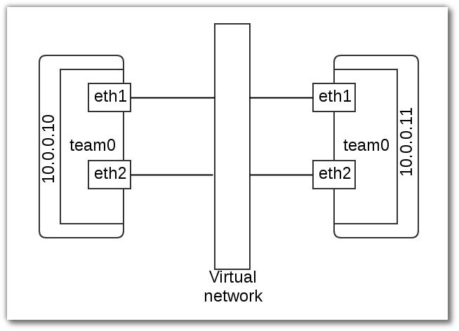

========================
Network Teaming & Bridge
========================

Teaming
===========

vagrant
-------
::

	# -*- mode: ruby -*-
	# vi: set ft=ruby :

	Vagrant.configure("2") do |config|
	  config.vm.box = "centos/7"
	  config.vm.define :server1 do |node|
		    node.vm.network :private_network, :ip => "10.0.0.10"
		    node.vm.network :private_network, :ip => "20.0.0.10"
		    node.vm.provider :libvirt do |domain|
		      domain.uri = 'qemu+unix:///system'
		      domain.driver = 'kvm'
		      domain.host = "server1.example.com"
		      domain.memory = 2048
		      domain.cpus = 2
		      domain.nested = true
		      domain.volume_cache = 'none'
		      domain.storage :file, :size => '20G'
		      domain.storage :file, :size => '20G'
		      domain.storage :file, :size => '20G'
		    end
	  end
	  config.vm.define :server2 do |node|
		    node.vm.network :private_network, :ip => "10.0.0.11"
		    node.vm.network :private_network, :ip => "20.0.0.11"
		    node.vm.provider :libvirt do |domain|
		      domain.uri = 'qemu+unix:///system'
		      domain.driver = 'kvm'
		      domain.host = "server2.example.com"
		      domain.memory = 2048
		      domain.cpus = 2
		      domain.nested = true
		      domain.volume_cache = 'none'
		    end
	  end

	end

vagrant accesss
---------------
เปิด terminal ใหม่ 2 terminal 
terminal 1 ใช้  access ไปที่ server1::

	vagrant ssh server1
    sudo su -
    hostnamectl set-hostname server1
    hostname
	
terminal 2 ใช้  access ไปที่  server2::

	vagrant ssh server2
    sudo su -
    hostnamectl set-hostname server1
    hostname

Config Team
***********
On Server1::

	# yum install -y teamd
 	
    //check kernel
    # modprobe team
	# modinfo team

	filename:       /lib/modules/3.10.0-327.18.2.el7.x86_64/kernel/drivers/net/team/team.ko
	alias:          rtnl-link-team
	description:    Ethernet team device driver
	author:         Jiri Pirko <jpirko@redhat.com>
	license:        GPL v2
	rhelversion:    7.2
	srcversion:     C59FD6905408120CA7C83CD
	depends:        
	intree:         Y
	vermagic:       3.10.0-327.18.2.el7.x86_64 SMP mod_unload modversions 
	signer:         CentOS Linux kernel signing key
	sig_key:        EB:27:91:DE:1A:BE:A5:F9:5A:A5:BC:B8:91:E1:33:2B:ED:29:8E:5E
	sig_hashalgo:   sha256

config
------
::

    //remove config
    
    # cd /etc/sysconfig/network-scripts/
    # rm -rf ifcfg-eth1
    # rm -rf ifcfg-eth2

    # nmcli con show
    NAME          UUID                                  TYPE            DEVICE 
    eth1          8a71d519-dd24-4fa3-bec2-61f0278d667b  802-3-ethernet  eth1   
    eth2          7856b66e-bcd9-45f6-8917-40f7e7eb4c27  802-3-ethernet  eth2   
    eth0          49fe963e-b0e5-4604-8745-e319f8c7e162  802-3-ethernet  eth0   
    
    //delete connection ``eth1``  ``eth2``

	# nmcli con del 8a71d519-dd24-4fa3-bec2-61f0278d667b
	# nmcli con del 7856b66e-bcd9-45f6-8917-40f7e7eb4c27
	# nmcli c s

	NAME         UUID                                  TYPE            DEVICE 
	eth0         81208c98-cfc3-4a14-9595-0eb2f54a7966  802-3-ethernet  eth0   
	System eth0  5fb06bd0-0bb0-7ffb-45f1-d6edd65f3e03  802-3-ethernet  -- 

Create connection ชนิด team  ชื่อ myteam0  พร้อมกับการสร้าง interface ใหม่ ชื่อ team0
::
    
          //สร้าง team
	# nmcli con add type team con-name team0 ifname team0 config '{ "runner": {"name": "loadbalance"}}'
	Connection 'myteam0' (bc60cf30-a296-44b5-8157-dceabe7a06c7) successfully added.

         //สร้างให้เองอัตโนมัติ
    cat /etc/sysconfig/network-scripts/ifcfg-myteam0 

	DEVICE=team0
	TEAM_CONFIG="{ \"runner\": {\"name\": \"loadbalance\"}}"
	DEVICETYPE=Team
	BOOTPROTO=dhcp
	DEFROUTE=yes
	PEERDNS=yes
	PEERROUTES=yes
	IPV4_FAILURE_FATAL=no
	IPV6INIT=yes
	IPV6_AUTOCONF=yes
	IPV6_DEFROUTE=yes
	IPV6_PEERDNS=yes
	IPV6_PEERROUTES=yes
	IPV6_FAILURE_FATAL=no
	NAME=team0
	UUID=bc60cf30-a296-44b5-8157-dceabe7a06c7
	ONBOOT=yes

	//กำหนด ip
	# nmcli con mod team0 ipv4.addresses 10.0.0.10/24
	# nmcli con mod team0 ipv4.gateway 10.0.0.1
	# nmcli con mod team0 ipv4.method manual

    	//เพิ่ม  eth1 ให้เป็น team interface ชนิด  team-slave ของinterface team0 มีชื่อว่า team0-slave0 
	# nmcli con add type team-slave con-name team0-slave0 ifname eth1 master team0
	Connection 'team0-slave0' (329c1ff0-d674-46aa-9bd5-7af1b60d5327) successfully added.

	//เพิ่ม  eth2 ให้เป็น team interface ชนิด  team-slave ของinterface team0 มีชื่อว่า team0-slave1
	# nmcli con add type team-slave con-name team0-slave1 ifname eth2 master team0
	Connection 'team0-slave1' (eb9e1180-d8d3-4abe-a88e-42ffe1c8f72b) successfully added.
 
         //โดยที่ nmcli จะสร้าง config ให้แก่  connection ทั้ง team0-slave0 และ team0-slave1

    # cat /etc/sysconfig/network-scripts/ifcfg-team0-slave0
	NAME=team0-slave0
	UUID=329c1ff0-d674-46aa-9bd5-7af1b60d5327
	DEVICE=eth1
	ONBOOT=yes
	TEAM_MASTER=team0
	DEVICETYPE=TeamPort

	# cat /etc/sysconfig/network-scripts/ifcfg-team0-slave1
	NAME=team0-slave1
	UUID=eb9e1180-d8d3-4abe-a88e-42ffe1c8f72b
	DEVICE=eth2
	ONBOOT=yes
	TEAM_MASTER=team0
	DEVICETYPE=TeamPort

Activate Team
-------------
::

	# nmcli con up team0
	Connection successfully activated (D-Bus active path: /org/freedesktop/NetworkManager/ActiveConnection/3)

	# nmcli c s
	NAME          UUID                                  TYPE            DEVICE 
	eth0          49fe963e-b0e5-4604-8745-e319f8c7e162  802-3-ethernet  eth0   
	team0         3c59a2f2-5cb4-47a7-8593-f0c683d66c28  team            team0  
	team0-slave0  329c1ff0-d674-46aa-9bd5-7af1b60d5327  802-3-ethernet  eth1   
	team0-slave1  eb9e1180-d8d3-4abe-a88e-42ffe1c8f72b  802-3-ethernet  eth2   
	myteam0       bc60cf30-a296-44b5-8157-dceabe7a06c7  team            --     
	System eth0   5fb06bd0-0bb0-7ffb-45f1-d6edd65f3e03  802-3-ethernet  --  

	# teamdctl team0 state

    # teamdctl team0 config dump

	setup:
	  runner: loadbalance
	ports:
	  eth2
		link watches:
		  link summary: up
		  instance[link_watch_0]:
		    name: ethtool
		    link: up
		    down count: 0
	  eth1
		link watches:
		  link summary: up
		  instance[link_watch_0]:
		    name: ethtool
		    link: up
		    down count: 0

	//check port status
	# teamnl team0 ports
	 4: eth2: up 0Mbit HD 
	 3: eth1: up 0Mbit HD 
  
    #nmcli con reload

