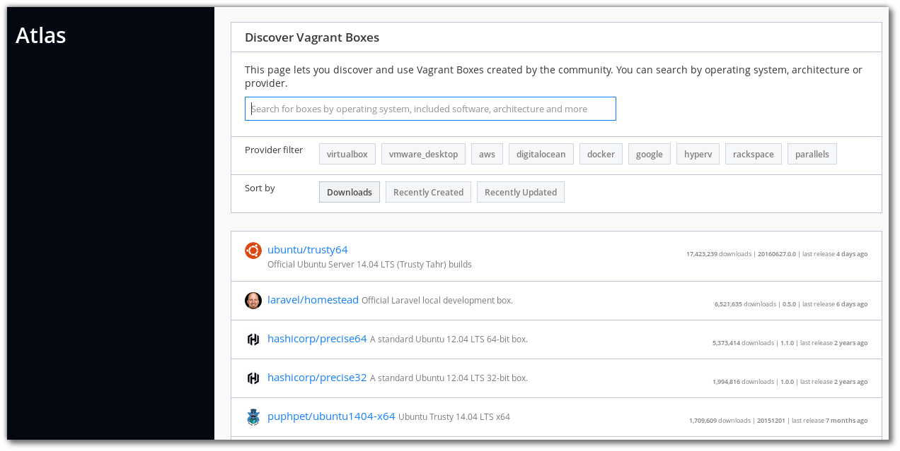
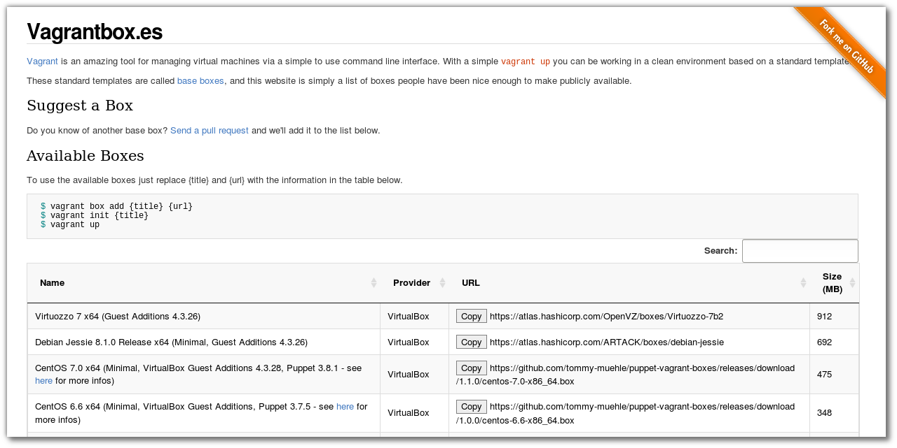
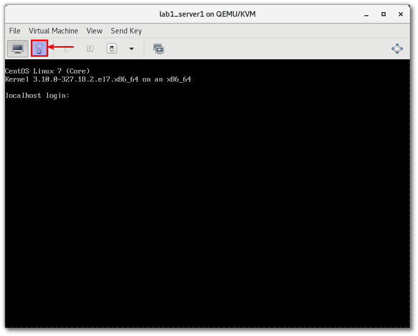
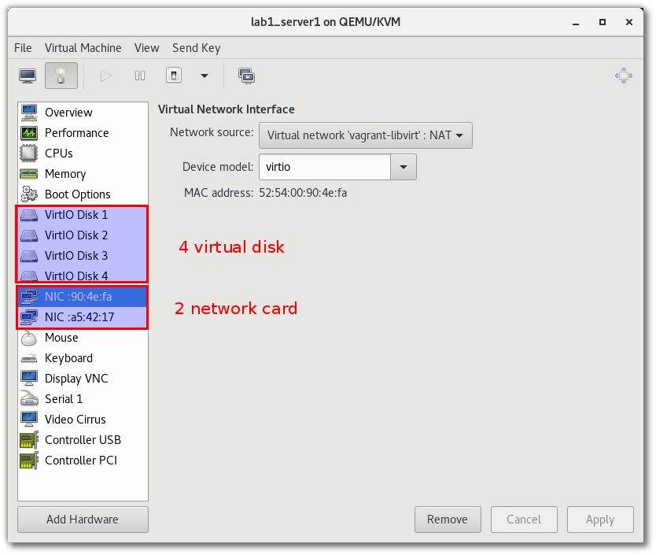
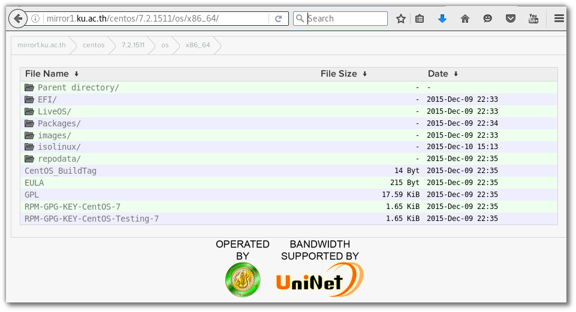
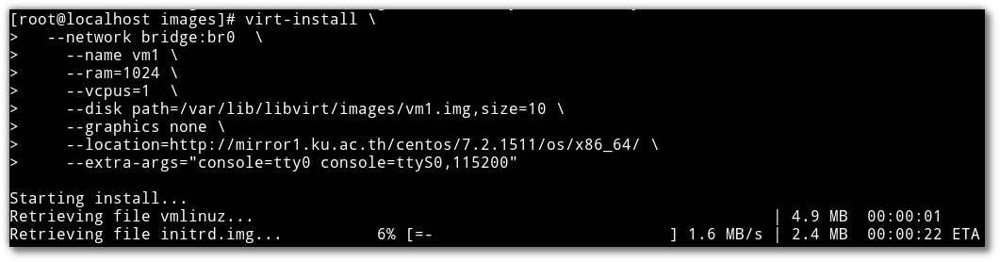

====================
Build Infrastructure
====================

Vagrant
=======
การใช้งาน vagrant เพื่อสร้าง development environment

.. seealso::

   * `vagrant by hasicorp <https://www.vagrantup.com/>`_; 
   * `vagrant libvirt เพื่อดู config <https://github.com/vagrant-libvirt/vagrant-libvirt>`_;

Install vagrant
***************
::

	sudo dnf group install "C Development Tools and Libraries"
	sudo dnf install  ruby-devel zlib-devel 
	sudo dnf install  libxslt  libxslt-devel  libxml2  libxml2-devel redhat-lsb
	sudo dnf install libxslt-devel libxml2-devel libvirt-devel libguestfs-tools-c ruby-devel
	sudo dnf install redhat-rpm-config patch
	sudo gem install nokogiri -v '1.6.8'
	wget https://releases.hashicorp.com/vagrant/1.8.4/vagrant_1.8.4_x86_64.rpm
	sudo dnf install vagrant_1.8.4_x86_64.rpm
	vagrant plugin install vagrant-libvirt
	vagrant plugin install vagrant-scp

repository
----------
สามารถค้นหาและdownload image เพื่อเตรียมทดสอบ https://atlas.hashicorp.com/boxes/search

อีกที่หนึ่ง http://www.vagrantbox.es/

Download box
::

	$ vagrant box add centos/7
	==> box: Loading metadata for box 'centos/7'
		box: URL: https://atlas.hashicorp.com/centos/7
	This box can work with multiple providers! The providers that it
	can work with are listed below. Please review the list and choose
	the provider you will be working with.

	1) libvirt
	2) virtualbox

	Enter your choice: 

vagrantfile
-----------
สร้าง project directory เพื่อการทดสอบ และ download box เพื่อ add ภายหลัง
* download vagrant box `centos os 7 <https://atlas.hashicorp.com/centos/boxes/7/versions/1605.01/providers/libvirt.box>`_

:: 

	$ vagrant box add centos/7 ./libvirt.box
	$ mkdir project01
	$ cd project01
	$ vagrant init centos/7
	$ cat Vagrantfile
	(result เมื่อลบ comment ออก)
	# -*- mode: ruby -*-
	# vi: set ft=ruby :

	Vagrant.configure("2") do |config|
	  config.vm.box = "centos/7"
	end

	$ vagrant up --provider libvirt

เพิ่มเติม vagrantfile ด้านล่าง
::

	# -*- mode: ruby -*-
	# vi: set ft=ruby :

	Vagrant.configure("2") do |config|
	  config.vm.box = "centos/7"
	  config.vm.define :server1 do |node|
		node.vm.network :private_network, :ip => "10.0.0.10"
		node.vm.provider :libvirt do |domain|
		  domain.uri = 'qemu+unix:///system'
		  domain.driver = 'kvm'
		  domain.host = "server1.example.com"
		  domain.memory = 2048
		  domain.cpus = 2
		  domain.nested = true
		  domain.volume_cache = 'none'
		  domain.storage :file, :size => '20G'
		  domain.storage :file, :size => '20G'
		  domain.storage :file, :size => '20G'
		end
	  end
	  config.vm.define :server2 do |node|
		node.vm.network :private_network, :ip => "10.0.0.11"
		node.vm.provider :libvirt do |domain|
		  domain.uri = 'qemu+unix:///system'
		  domain.driver = 'kvm'
		  domain.host = "server2.example.com"
		  domain.memory = 2048
		  domain.cpus = 2
		  domain.nested = true
		  domain.volume_cache = 'none'
		end
	  end

	end

.. image:: images/vagrant004.png

กดเลือก double click lab1_server1  (lab1 ชื่อ  project directory และ server1 เป็น ชื่อ VM) 

กดเลือก รูปหลอดไฟเพื่อดูรายละเดียด

Connect to VM
-------------
สามารถเชื่อมผ่าน virsh
::

	[lab1]$ sudo virsh list
	 Id    Name                           State
	----------------------------------------------------
	 1     lab1_server2                   running
	 2     lab1_server1                   running

	[lab1]$ sudo virt-viewer lab1_server1

ให้ใช้ username vagrant และ password vagrant แล้วจึงค่อยเปลี่ยนเป็น root ด้วยคำสั่ง  ``sudo su -``

Create Bridge
*************
persistent bridge configure
---------------------------
::

	sudo su -
	mv /etc/sysconfig/network-scripts/ifcfg-enp3s0 /root

	ip a
	2: enp3s0: <BROADCAST,MULTICAST,UP,LOWER_UP> mtu 1500 qdisc fq_codel state UP group default qlen 1000
		link/ether 54:ee:75:8a:86:09 brd ff:ff:ff:ff:ff:ff
		inet 192.168.1.69/24 brd 192.168.1.255 scope global dynamic enp3s0
		   valid_lft 72724sec preferred_lft 72724sec

สร้าง config file ตาม template ด้านล่าง โดยใช้ข้อมูลจากด้านบน
::

	vi /etc/sysconfig/network-scripts/ifcfg-enp3s0

	DEVICE=enp3s0
	TYPE=Ethernet
	HWADDR=54:ee:75:8a:86:09
	BOOTPROTO=none
	ONBOOT=yes
	BRIDGE=br0

	vi /etc/sysconfig/network-scripts/ifcfg-br0

	DEVICE=br0
	TYPE=Bridge
	IPADDR=192.168.1.69
	NETMASK=255.255.255.0
	ONBOOT=yes
	BOOTPROTO=none

	nmcli con reload

	ip link set dev enp3s0 down
	ip link set dev enp3s0 up
	ip a

	(result)
	2: enp3s0: <BROADCAST,MULTICAST,UP,LOWER_UP> mtu 1500 qdisc fq_codel master br0 state UP group default qlen 1000
		link/ether 54:ee:75:8a:86:09 brd ff:ff:ff:ff:ff:ff

	15: br0: <NO-CARRIER,BROADCAST,MULTICAST,UP> mtu 1500 qdisc noqueue state DOWN group default qlen 1000
		link/ether 32:dd:7e:5d:ba:44 brd ff:ff:ff:ff:ff:ff
		inet 192.168.1.69/24 brd 192.168.1.255 scope global br0
		   valid_lft forever preferred_lft forever

ping ทดสอบผ่านทาง br0 ด้วยการกำหนด ``-I br0``
::

	# ping -I br0 google.com
	PING google.com (172.217.25.142) from 192.168.1.69 br0: 56(84) bytes of data.
	64 bytes from kul01s07-in-f14.1e100.net (172.217.25.142): icmp_seq=24 ttl=53 time=34.1 ms
	64 bytes from kul01s07-in-f14.1e100.net (172.217.25.142): icmp_seq=25 ttl=53 time=34.4 ms
	64 bytes from kul01s07-in-f14.1e100.net (172.217.25.142): icmp_seq=26 ttl=53 time=41.4 ms
	64 bytes from kul01s07-in-f14.1e100.net (172.217.25.142): icmp_seq=27 ttl=53 time=35.7 ms

เพิ่ม config ให้แก่ kernel เพื่อเพิ่ม ประสิทธิภาพ ให้แก่ bridge
::

	vi /etc/sysctl.conf

	net.bridge.bridge-nf-call-ip6tables = 0
	net.bridge.bridge-nf-call-iptables = 0
	net.bridge.bridge-nf-call-arptables = 0

	sysctl -p 
	net.ipv4.ip_forward = 1
	sysctl: cannot stat /proc/sys/net/bridge/bridge-nf-call-ip6tables: No such file or directory
	sysctl: cannot stat /proc/sys/net/bridge/bridge-nf-call-iptables: No such file or directory
	sysctl: cannot stat /proc/sys/net/bridge/bridge-nf-call-arptables: No such file or directory

error เกิดจากยังไม่ได้โหลด kernel module
::

	lsmod |grep  br_netfilter
	modprobe br_netfilter
	lsmod |grep  br_netfilter
	br_netfilter           24576  0
	bridge                126976  2 br_netfilter,ebtable_broute

โหลดอีกครั้ง
::

	# sysctl -p
	net.ipv4.ip_forward = 1
	net.bridge.bridge-nf-call-ip6tables = 0
	net.bridge.bridge-nf-call-iptables = 0
	net.bridge.bridge-nf-call-arptables = 0

ตรวจสอบการเชื่อมต่อ ระหว่่าง br0 และ enp3s0
::

	# brctl show
	bridge name	bridge id		STP enabled	interfaces
	br0		8000.54ee758a8609	no		enp3s0

ทดสอบการสร้าง vm
::

	virt-install \
	  	--network bridge:br0  \
		--name vm1 \
		--ram=1024 \
		--vcpus=1  \
		--disk path=/var/lib/libvirt/images/vm1.img,size=10 \
		--graphics none \
		--location=http://mirror1.ku.ac.th/centos/7.2.1511/os/x86_64/ \
		--extra-args="console=tty0 console=ttyS0,115200"

